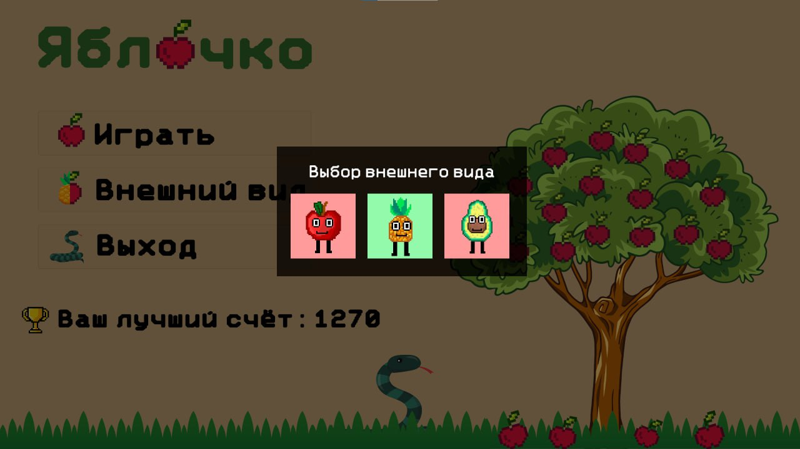
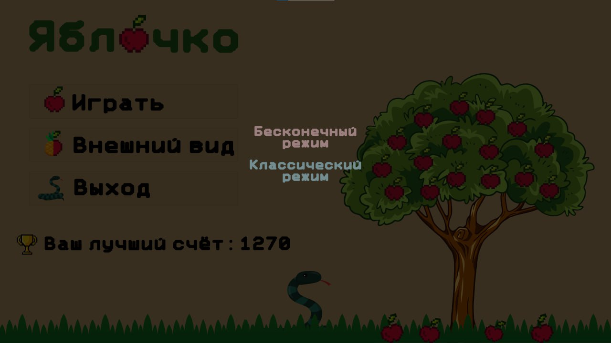
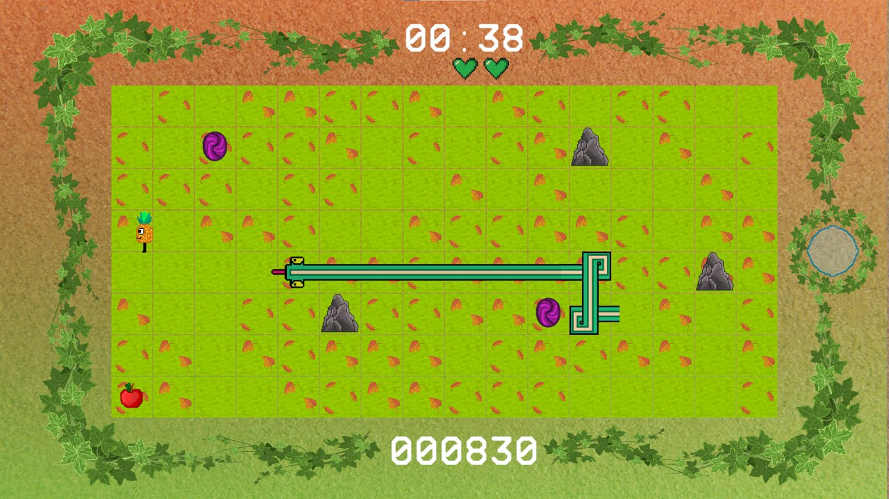
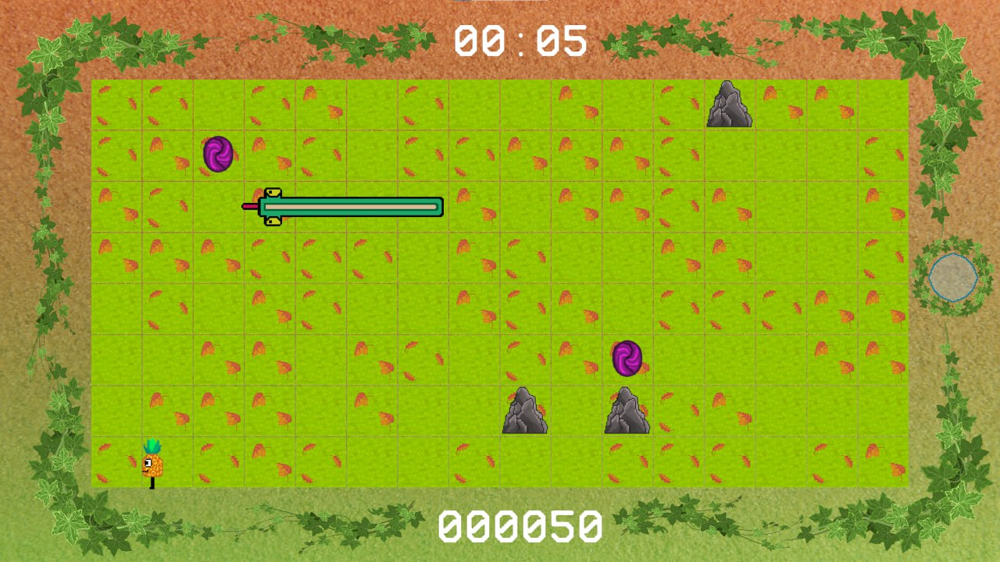

Eng | [Rus](Resources/Localization%20Readme/README_rus.md)

# Unity project - Bullseye

This game project was created as part of a **three-day hackathon** and later refined.

## Technologies

* Engine: **Unity**
* Programming language: **C#**
* Version control system: **Git**
* Snake Artificial Intelligence: **Algorithm A***
* Design of user interface and location elements: **Photoshop**, **Illustrator**, **Krita**

## Platform

*Windows

## Game description

The game is based on the well-known game “Snake” with one important difference - the player plays for the bullseye and runs away from the snake.
Various bonuses appear on the map to help with this.

There are two game modes: **normal** and **endless**.

In the normal mode of the game you need to use stones to kill the snake and win, and in the endless mode you need to survive as much as possible
longer.

## Screenshots

### Main menu:

### Choice of appearance:

### Game mode information:

### Game mode selection:

### Gameplay in normal mode:

### Gameplay in Endless Mode:
