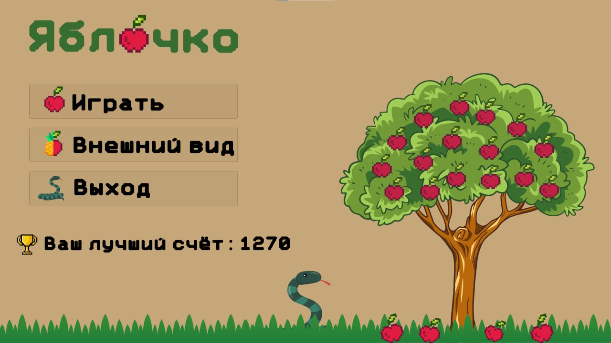
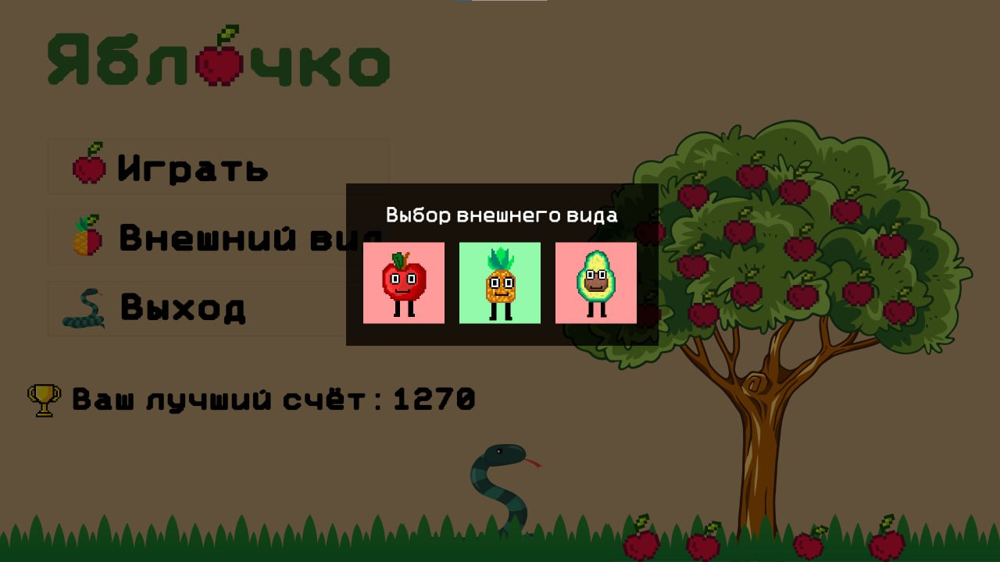
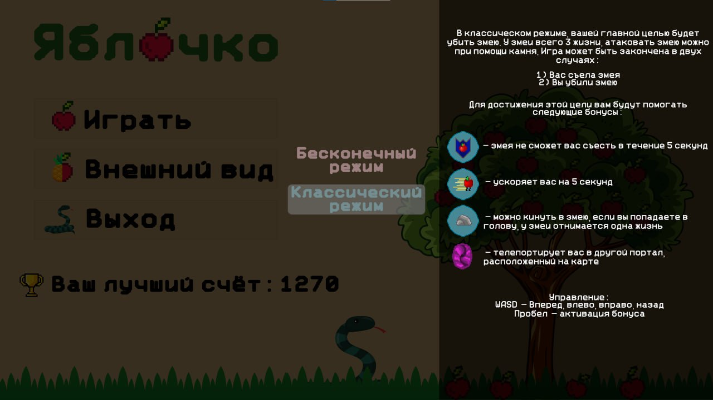
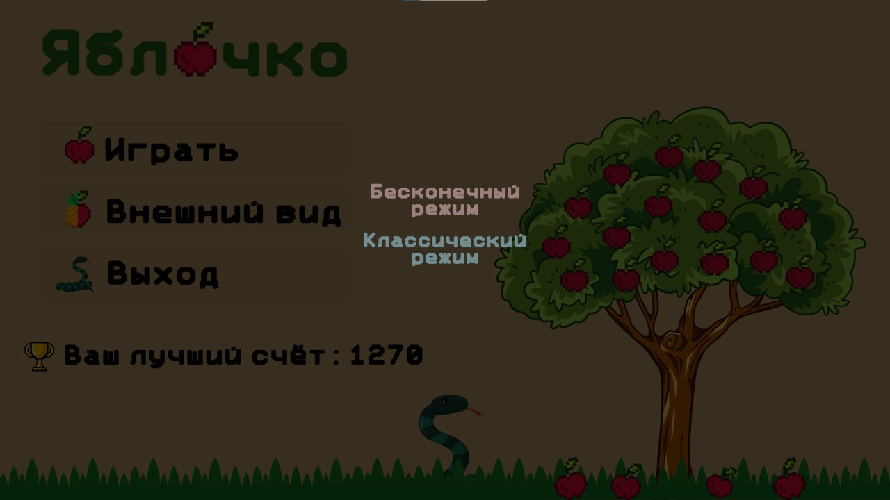
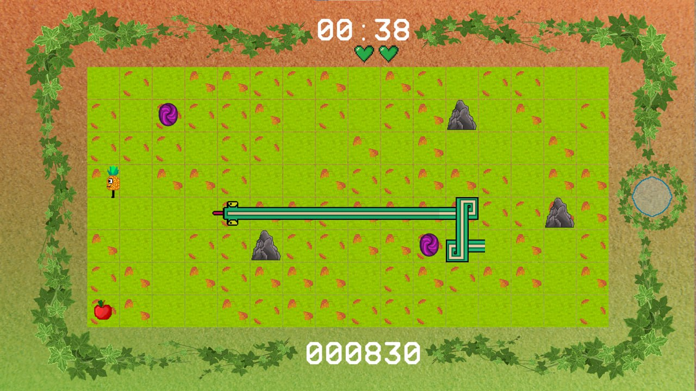
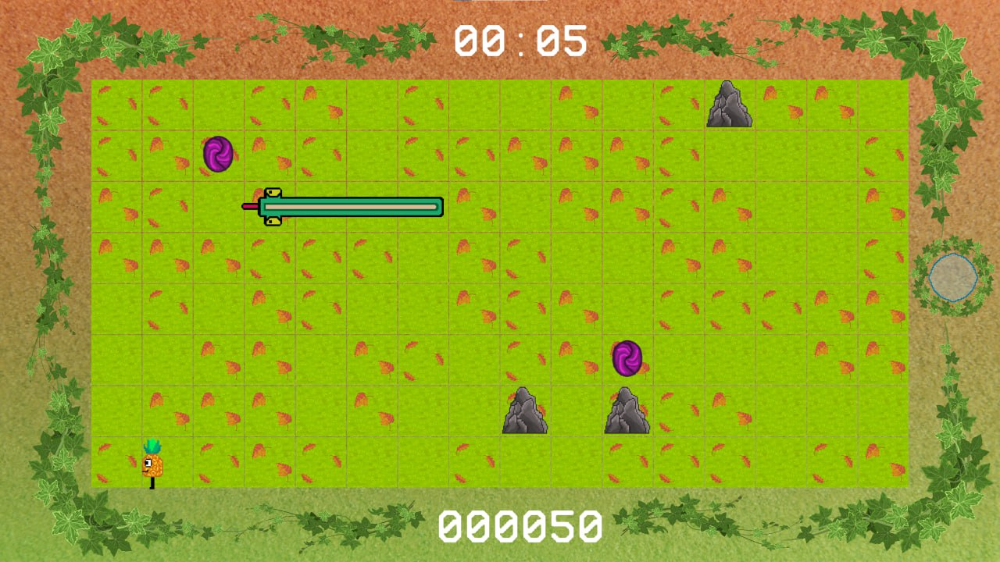

[Eng](../../README.md) | Rus

# Unity проект - Яблочко

Этот проект игры был создан в рамках **трехдневного хакатона** и позднее доработан.

## Технологии

* Движок: **Unity**
* Язык программирования: **C#**
* Система контроля версий: **Git**
* Искусственный интеллект змейки: **Алгоритм A***
* Дизайн пользовательского интерфейса и элементов локаций: **Photoshop**, **Illustrator**, **Krita**

## Платформа

* Windows

## Описание игры

Игра основана на всем известной игре «Змейка» с одним важным отличием — игрок играет за яблочко и убегает от змеи.
На карте появляются различные бонусы, чтобы помочь в этом.

Присутствуют два режима игры: **обычный** и **бесконечный**.

В обычном режиме игры требуется использовать камни, чтобы убить змею и победить, а бесконечном — выжить как можно
дольше.

## Скриншоты

### Главное меню:

### Выбор внешнего вида:

### Информация о режиме игры:

### Выбор режима игры:

### Игровой процесс в обычном режиме:

### Игровой процесс в бесконечном режиме:
